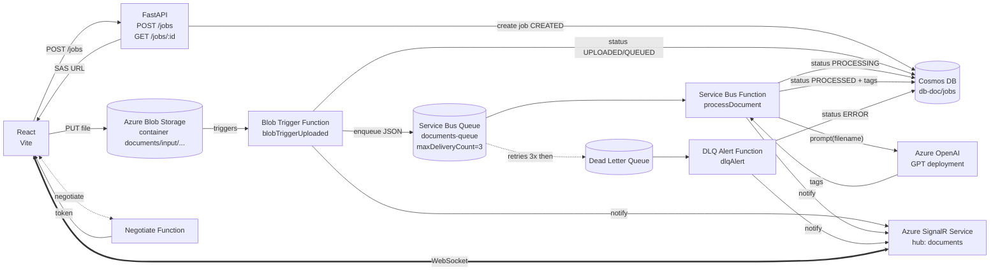

# M2DevCloud — Pipeline cloud asynchrone (IA + DLQ + SignalR)

Mini-projet M2 DevCloud — pipeline événementiel Azure de traitement de documents :
upload via React → API FastAPI → Blob Storage → **Azure Functions** → **Service Bus**
→ **tagging IA (Azure OpenAI)** → **Cosmos DB** → **notifications temps réel (SignalR)**.

La couche déjà acquise en cours (création de job FastAPI + Cosmos + SAS + upload Blob)
est conservée telle quelle. Ce mini-projet ajoute **tout ce qui se passe après l'upload**.

---

## 1. Architecture



## 2. États métier

```
CREATED → UPLOADED → QUEUED → PROCESSING → PROCESSED
                                        ↘ ERROR
```

| État | Émis par | Notification SignalR |
|------|----------|----------------------|
| `CREATED` | API FastAPI (`POST /jobs`) | — |
| `UPLOADED` | Blob Trigger | "Fichier reçu" |
| `QUEUED` | Blob Trigger (après envoi Service Bus) | "Mis en file de traitement" |
| `PROCESSING` | processDocument | "Traitement IA en cours" |
| `PROCESSED` | processDocument | "Tagging terminé" (+ tags) |
| `ERROR` | processDocument (échec direct) ou dlqAlert (après DLQ) | "Erreur de traitement" |

## 3. Arborescence

```
m2devcloud-main/
├── .gitlab-ci.yml                  # Pipeline CI/CD (install → lint → build → deploy)
├── README.md                       # ce fichier
├── AUTHORS.TXT                     # membres du groupe + responsabilités
├── infra/arm/
│   ├── main.json                   # Service Bus + DLQ + SignalR + Function App + AI Insights
│   ├── parameters.sample.json
│   └── readme.md
└── src/
    ├── api/                        # FastAPI (acquis, non modifié)
    │   └── app/...
    ├── functions/                  # Azure Functions Node.js v4  ★ ajouté
    │   ├── host.json
    │   ├── package.json
    │   ├── local.settings.sample.json
    │   └── src/
    │       ├── shared/             # cosmos.js, ai.js, notify.js, serviceBus.js
    │       └── functions/
    │           ├── blobTriggerUploaded.js   # Blob → Service Bus + SignalR (UPLOADED/QUEUED)
    │           ├── processDocument.js       # Service Bus → IA → Cosmos + SignalR (PROCESSING/PROCESSED)
    │           ├── dlqAlert.js              # DLQ → Cosmos + SignalR (ERROR)
    │           └── negotiate.js             # SignalR negotiate (+ health)
    └── web/                        # React + Vite ★ mis à jour
        ├── .env.example
        ├── package.json            # ajout: @microsoft/signalr
        └── src/
            ├── App.jsx             # SignalR client + composants
            ├── components/
            │   ├── FileUploader.jsx
            │   └── JobStatusCard.jsx
            └── services/
                ├── api.js
                ├── blob.js
                └── signalr.js
```

## 4. Tagging IA

Implémentation : `src/functions/src/shared/ai.js`.

- **Cible principale** : Azure OpenAI (`AZURE_OPENAI_ENDPOINT` + `AZURE_OPENAI_KEY` + `AZURE_OPENAI_DEPLOYMENT`).
- **Fallback** : règles simples (`fallbackTags()`) — autorisé par l'énoncé. Activé si
  les variables ne sont pas configurées **ou** si l'appel API échoue **ou** si la
  réponse n'est pas un JSON valide.

Prompt envoyé :

> Analyse le nom de fichier suivant et génère entre 3 et 8 tags courts en français.
> Nom du fichier : `<filename>`
> Retourne uniquement un tableau JSON de chaînes.

Sortie persistée :

```json
{
  "id": "123",
  "status": "PROCESSED",
  "tags": ["cv", "rh", "azure", "cloud", "pdf"],
  "tagSource": "azure-openai",
  "processedAt": "2026-04-27T10:45:00Z"
}
```

## 5. Dead Letter Queue

- Configurée dans `infra/arm/main.json` : `maxDeliveryCount=3`, `deadLetteringOnMessageExpiration=true`.
- La Function `processDocument` **lève une exception** lorsqu'une erreur survient
  (message mal formé, document introuvable, IA en panne après fallback impossible,
  exception réseau). Le broker Service Bus relivre le message jusqu'à 3 fois puis
  le déplace automatiquement vers `documents-queue/$DeadLetterQueue`.
- La Function `dlqAlert` écoute la sous-queue DLQ et :
  - récupère `documentId` du body
  - met à jour Cosmos : `status=ERROR`, `errorMessage`, `errorAt`
  - émet une notification SignalR `status=ERROR`

Cas de déclenchement de la DLQ couverts par le code :

| Cas | Mécanisme |
|-----|-----------|
| Message mal formé (pas de `documentId` / `fileName`) | `throw` dans `processDocument.js` |
| Document introuvable en Cosmos | `throw` dans `processDocument.js` |
| Échec répété de l'IA + fallback impossible | Le fallback réussit toujours, mais toute autre exception non gérée |
| Cosmos indisponible | Erreur SDK propagée → `throw` |

## 6. Notifications temps réel (SignalR)

- Service en mode **Serverless** (requis pour utiliser le binding de sortie SignalR depuis les Functions).
- Hub : `documents`. Événement : `documentUpdate`. Diffusion **broadcast** ; le
  client React filtre côté front par `documentId`. (Choix volontaire pour la
  simplicité ; un mode "groupes" est trivial à activer si besoin.)
- Negotiate : `GET /api/negotiate` sur la Function App — appelé automatiquement
  par `@microsoft/signalr` avant d'ouvrir la WebSocket.

Format d'événement (cf. `src/functions/src/shared/notify.js`) :

```json
{
  "documentId": "123",
  "status": "PROCESSED",
  "message": "Tagging terminé",
  "timestamp": "2026-04-27T10:45:01.234Z",
  "tags": ["cv", "rh", "azure"]
}
```

## 7. Démarrage local

### Prérequis
- Node.js 20+, npm
- Azure Functions Core Tools v4 (`npm i -g azure-functions-core-tools@4 --unsafe-perm true`)
- Une ressource Cosmos DB, Service Bus, SignalR et (optionnel) Azure OpenAI déployées (voir `infra/arm/`)

### API FastAPI (déjà existante)
```bash
cd src/api
pip install -r requirements.txt
python -m uvicorn app.main:app --reload
```

### Functions
```bash
cd src/functions
cp local.settings.sample.json local.settings.json
# Renseigner les valeurs réelles
npm install
func start
```

### Web
```bash
cd src/web
cp .env.example .env
# Renseigner VITE_API_BASE_URL et VITE_FUNCTIONS_BASE_URL
npm install
npm run dev
```

## 8. Déploiement (GitLab CI/CD)

Variables à configurer dans **Settings → CI/CD → Variables** :

| Variable | Type | Rôle |
|----------|------|------|
| `AZURE_CLIENT_ID` | Variable | App registration utilisée pour le login `az` |
| `AZURE_CLIENT_SECRET` | **Masked** | Secret du service principal |
| `AZURE_TENANT_ID` | Variable | Tenant Azure |
| `AZURE_SUBSCRIPTION_ID` | Variable | Souscription |
| `AZURE_RESOURCE_GROUP` | Variable | Groupe de ressources cible |
| `AZURE_FUNCTION_APP_NAME` | Variable | Nom de la Function App déployée |
| `AZURE_STATIC_WEB_APP_TOKEN` | **Masked** | Deployment token Static Web Apps |
| `VITE_API_BASE_URL` | Variable | URL publique de l'API FastAPI |
| `VITE_FUNCTIONS_BASE_URL` | Variable | URL publique de la Function App |

Secrets injectés en tant qu'**App Settings** sur la Function App (configurés par le
template ARM, mais peuvent aussi être réappliqués depuis la CI au besoin) :
`COSMOS_ENDPOINT`, `COSMOS_KEY`, `SERVICE_BUS_CONNECTION_STRING`,
`AzureSignalRConnectionString`, `AZURE_OPENAI_ENDPOINT`, `AZURE_OPENAI_KEY`,
`AZURE_OPENAI_DEPLOYMENT`.

Le pipeline (`.gitlab-ci.yml`) exécute :

1. **install** — `npm ci` pour Functions et Web (artefacts node_modules)
2. **lint** — `npm run lint` sur le frontend
3. **build** —
   - `vite build` du frontend (avec injection des variables `VITE_*` dans `.env.production`)
   - zip du dossier Functions (sans `node_modules`, l'install se fait sur le serveur via Oryx)
4. **deploy** (branche `main` uniquement) —
   - `az functionapp deployment source config-zip` vers la Function App
   - `swa deploy` vers Azure Static Web Apps

## 9. Tests manuels

| Scénario | Résultat attendu |
|----------|------------------|
| Fichier valide (ex. `cv_amine_azure.pdf`) | `CREATED → UPLOADED → QUEUED → PROCESSING → PROCESSED` avec tags |
| Fichier vide (0 octet) | `status = ERROR` direct (court-circuit dans le Blob Trigger) |
| Suppression du document Cosmos entre l'upload et le traitement | Message Service Bus mis en DLQ après 3 tentatives → `dlqAlert` passe en `ERROR` |
| Message invalide injecté à la main dans la queue | DLQ → `dlqAlert` → `ERROR` |
| Azure OpenAI indisponible | Tagging via `fallbackTags()`, statut final = `PROCESSED`, `tagSource = "fallback-rules"` |

## 10. Sécurité

- Aucun secret n'est commité : tous passent par variables GitLab CI/CD ou App Settings Azure.
- `local.settings.json` est dans `.gitignore`.
- `httpsOnly = true` sur la Function App (ARM).
- Les SAS Blob émis par l'API ont une validité de 15 minutes.

---

## Auteurs

Voir `AUTHORS.TXT`.
