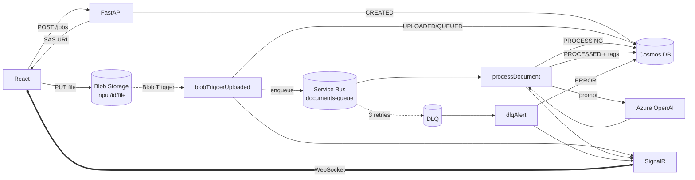

# Soutenance — M2DevCloud
## Pipeline cloud asynchrone avec IA, notifications temps réel et DLQ

**Durée cible : 15 minutes** — 13 slides + démo + Q&A
**Groupe : `<NOM_GROUPE>` — `<Prénom Nom>` & `<Prénom Nom>`**

> Convention : sous chaque slide → **À l'écran**, **Speaker notes** (à dire à voix haute, paraphraser), **⏱ Durée cumulée**.

---

## Slide 1 — Couverture & contexte (0:45)

**À l'écran**
- Titre : *"Pipeline cloud asynchrone avec IA, notifications et DLQ"*
- Logos : Azure · React · FastAPI · OpenAI
- Binôme + responsabilités (1 ligne chacun)

**Speaker notes**
Bonjour. Nous présentons notre mini-projet **M2DevCloud**. Il prend la suite directe du **cours** : on avait déjà un frontend React, une API FastAPI qui crée un job dans Cosmos DB et émet une SAS Blob pour l'upload. **Notre travail = tout ce qui se passe après l'upload** : Azure Functions, Service Bus, IA, DLQ, notifications temps réel, et le déploiement GitLab CI/CD entièrement automatisé.

⏱ **0:45**

---

## Slide 2 — Le problème (0:45)

**À l'écran** — 3 contraintes
- **Asynchrone** : pas de traitement IA dans la requête HTTP
- **Push temps réel** : l'utilisateur doit voir où en est son document, sans polling
- **Résilience** : si l'IA plante, si un message est invalide, on ne perd rien

**Speaker notes**
Métier : un utilisateur dépose un CV ou une facture, on doit le **classer** automatiquement avec des tags. Techniquement on a trois contraintes :
1. Le traitement IA ne peut pas bloquer la requête HTTP de l'utilisateur.
2. Il faut un retour visuel en temps réel — pas de polling toutes les 2 secondes, c'est moche et ça charge l'API.
3. Si l'IA est down, si un message est corrompu, on ne perd pas l'événement → **Dead Letter Queue**.

⏱ **1:30**

---

## Slide 3 — Architecture cible (2:00)

**À l'écran** — diagramme mermaid



**Speaker notes**
Trois zones :
1. **Zone synchrone** (à gauche) — React + FastAPI + Blob, c'est **l'acquis du cours**.
2. **Zone événementielle** (au centre) — trois Azure Functions Node.js v4 : une déclenchée par le **Blob**, une par la **Service Bus Queue**, une par la **Dead Letter Queue**.
3. **Zone notifications** (à droite) — SignalR Service en mode **Serverless** qui push vers React via WebSocket.

Le **fil rouge** d'un document : il rentre par l'upload, traverse le pipeline, et à chaque étape **le statut est mis à jour en Cosmos** + **une notification SignalR est diffusée**. En cas d'échec, après 3 retries, DLQ → ERROR.

⏱ **3:30**

---

## Slide 4 — États métier & contrat de notification (1:00)

**À l'écran**
```
CREATED → UPLOADED → QUEUED → PROCESSING → PROCESSED
                                        ↘ ERROR
```

| État | Émis par | Notification SignalR |
|---|---|---|
| CREATED | FastAPI | — |
| UPLOADED | Blob Trigger | "Fichier reçu" |
| QUEUED | Blob Trigger | "Mis en file de traitement" |
| PROCESSING | processDocument | "Traitement IA en cours" |
| PROCESSED | processDocument | "Tagging terminé" + tags |
| ERROR | processDocument / dlqAlert | "Erreur de traitement" |

**Speaker notes**
Six états, un **contrat unique** : pour chaque transition, le front reçoit un événement SignalR `documentUpdate` avec `documentId`, `status`, `message` lisible, et en cas de succès les `tags`. Résultat : côté React, **un seul handler** qui filtre par `documentId`. C'est ce qui rend l'intégration aussi simple.

⏱ **4:30**

---

## Slide 5 — Blob Trigger Function (1:15)

**À l'écran** — extrait code
```js
app.storageBlob('blobTriggerUploaded', {
  path: '%BLOB_CONTAINER%/input/{documentId}/{fileName}',
  connection: 'BLOB_CONNECTION_STRING',
  extraOutputs: [signalRMessages],
  handler: async (blob, context) => {
    // 1. validation (taille, doc existe en Cosmos)
    // 2. patch UPLOADED
    // 3. sendMessage(ServiceBus, { documentId, fileName, blobName, size, uploadedAt })
    // 4. patch QUEUED
    // 5. push notifications UPLOADED + QUEUED
  }
});
```

**Speaker notes**
La première Function se déclenche dès qu'un blob est créé sous `input/{documentId}/{fileName}`. Le `documentId` est **extrait directement du chemin** grâce au pattern. Quatre étapes :
1. **Garde-fous** : fichier vide (0 octet) ou document inexistant en Cosmos → ERROR direct, on n'encombre pas la queue.
2. **UPLOADED** dans Cosmos.
3. **Publish** sur Service Bus avec le payload JSON.
4. **QUEUED** + **2 notifications SignalR** (UPLOADED puis QUEUED) — l'utilisateur voit ces deux étapes apparaître **instantanément**.

⏱ **5:45**

---

## Slide 6 — Service Bus + DLQ (1:00)

**À l'écran** — extrait ARM (`infra/arm/main.json`)
```json
"maxDeliveryCount": 3,
"deadLetteringOnMessageExpiration": true,
"defaultMessageTimeToLive": "P14D"
```
+ schéma : Queue → 3 tentatives → DLQ

**Speaker notes**
La queue `documents-queue` est configurée en ARM avec deux paramètres critiques :
- `maxDeliveryCount = 3` : après 3 échecs, le broker Azure **déplace automatiquement** le message vers `$DeadLetterQueue`.
- `deadLetteringOnMessageExpiration = true` : un message qui expire (14 jours) part aussi en DLQ.

**Point important** : c'est le broker qui gère ça, **on ne code rien** pour la DLQ. Notre code applicatif n'a qu'à **lever une exception** quand il ne peut pas traiter — Service Bus s'occupe du reste.

⏱ **6:45**

---

## Slide 7 — Function traitement + Tagging IA (2:00)

**À l'écran**
- Snippet `processDocument.js` (validation → PROCESSING → IA → PROCESSED)
- Prompt envoyé à Azure OpenAI :
> *Analyse le nom de fichier suivant et génère entre 3 et 8 tags courts en français.*
> *Nom du fichier : `cv_amine_azure.pdf`*
> *Retourne uniquement un tableau JSON de chaînes.*
- Réponse : `["cv", "rh", "azure", "cloud", "document", "pdf"]`

**Speaker notes**
La deuxième Function est le **cœur** du système. Elle lit la queue, et pour chaque message :

1. **Validation stricte** : si pas de `documentId`/`fileName`, on **throw**. Si le document n'existe pas en Cosmos, on **throw**. → retry automatique, et après 3 fois → **DLQ**.
2. **PROCESSING** : Cosmos + notification.
3. **Appel IA** : SDK officiel `openai` avec sa subclass `AzureOpenAI`, deployment `gpt-4o-mini` par défaut. Prompt strict pour avoir uniquement un tableau JSON.
4. **Fallback** : `parseTags()` essaie plusieurs stratégies, et si tout échoue, `fallbackTags()` utilise un système de **règles regex** (CV, facture, Azure, AWS, extensions…). **Autorisé explicitement par l'énoncé.**
5. **PROCESSED** : on persiste `tags` + `tagSource` (`azure-openai` ou `fallback-rules`) en Cosmos, et on notifie React avec les tags.

**Moins de 100 lignes** parce que le binding `extraOutputs` SignalR fait le boulot d'envoi pour nous.

⏱ **8:45**

---

## Slide 8 — DLQ Alert Function (1:00)

**À l'écran**
```js
app.serviceBusQueue('dlqAlert', {
  queueName: '%SERVICE_BUS_QUEUE%/$DeadLetterQueue',
  connection: 'SERVICE_BUS_CONNECTION_STRING',
  handler: async (message, context) => {
    const reason = context.triggerMetadata?.deadLetterReason;
    const desc   = context.triggerMetadata?.deadLetterErrorDescription;
    await patchDocument(documentId, {
      status: 'ERROR',
      errorMessage: `${reason}: ${desc}`,
      errorAt: new Date().toISOString()
    });
    context.extraOutputs.set(signalRMessages, ...);
  }
});
```

**Speaker notes**
La troisième Function écoute **exclusivement la sous-queue DLQ** — il suffit de suffixer le nom par `/$DeadLetterQueue`. Elle :
1. Récupère le **motif** du dead-letter ajouté par le broker (`deadLetterReason`, `deadLetterErrorDescription`).
2. Met à jour Cosmos en **ERROR** avec ce motif détaillé.
3. Notifie React → badge rouge dans l'UI.

C'est notre **filet de sécurité ultime** : aucun événement ne tombe dans le vide.

⏱ **9:45**

---

## Slide 9 — Notifications SignalR temps réel (1:15)

**À l'écran**
- Schéma : Function → SignalR Serverless → WebSocket → React
- Code negotiate (10 lignes)
- Hub : `documents` / event : `documentUpdate`

**Speaker notes**
On a choisi **SignalR en mode Serverless** parce que c'est le seul qui permet aux Functions d'utiliser un **output binding**. Côté Functions, on déclare :
```js
output.generic({ type: 'signalR', name: 'signalRMessages', hubName: 'documents', ... })
```
Et dans le handler : `context.extraOutputs.set(...)`. SignalR push aux clients.

Côté React : `@microsoft/signalr`. Le client appelle `/api/negotiate` (notre Function HTTP) → token signé → WebSocket ouverte → on écoute `documentUpdate` et on filtre par `documentId`.

**~50 lignes côté front** pour avoir du push temps réel.

**Démo visuelle** : badge gris → bleu → orange (pulsation) → vert + bulles de tags qui apparaissent.

⏱ **11:00**

---

## Slide 10 — CI/CD GitLab + sécurité (0:45)

**À l'écran**
- Pipeline 4 stages : `install` → `lint` → `build` → `deploy`
- Tableau des **9 variables CI/CD** (`AZURE_CLIENT_ID`, `AZURE_CLIENT_SECRET`, `AZURE_TENANT_ID`, `AZURE_SUBSCRIPTION_ID`, `AZURE_RESOURCE_GROUP`, `AZURE_FUNCTION_APP_NAME`, `AZURE_STATIC_WEB_APP_TOKEN`, `VITE_API_BASE_URL`, `VITE_FUNCTIONS_BASE_URL`)

**Speaker notes**
Déploiement **100 % automatisé** via `.gitlab-ci.yml`. Quatre stages :
- `install` : `npm ci` pour Functions et Web
- `lint` : ESLint sur le frontend
- `build` : `vite build` pour le front + zip des Functions
- `deploy` (branche `main` uniquement) :
  - Functions → `az functionapp deployment source config-zip` via service principal
  - Frontend → `swa deploy` Azure Static Web Apps via token

**Aucun secret commité.** Tout passe par variables GitLab masquées et App Settings Azure posés par le template ARM.

⏱ **11:45**

---

## Slide 11 — Démo (2:00)

**À l'écran** : React | logs Functions | Cosmos Data Explorer (3 fenêtres côte à côte)

**Scénario 1 — Nominal (45 s)**
- Dépose `cv_amine_azure.pdf` → "Envoyer".
- Badge **temps réel** : CREATED → UPLOADED → QUEUED → PROCESSING → PROCESSED.
- Tags `["cv", "rh", "azure", "cloud", "pdf"]` s'affichent.
- Document mis à jour visible dans Cosmos.

**Scénario 2 — Fichier vide (30 s)**
- Upload `empty.pdf` (0 octet) → **ERROR direct** (court-circuit Blob Trigger).
- Notification rouge "Fichier vide".

**Scénario 3 — DLQ (45 s)**
- Injection manuelle d'un JSON invalide dans la queue via le portail Azure.
- 3 tentatives échouent dans les logs `processDocument`.
- Le message arrive en DLQ → `dlqAlert` se déclenche → badge ERROR sur le frontend.

**Speaker notes pendant la démo** : commenter à voix haute chaque transition, montrer simultanément (1) le front, (2) les logs, (3) Cosmos. Ça matérialise l'asynchronisme et la résilience.

⏱ **13:45**

---

## Slide 12 — Bilan & barème (1:00)

**À l'écran**

| Critère | Pts | Couverture |
|---|---|---|
| Service Bus | 3 | Queue + DLQ ARM, trigger SB, envoi SDK |
| Function traitement | 4 | `processDocument.js` complet (validation, statuts, IA, persistance) |
| Tagging IA | 4 | Azure OpenAI + prompt FR + fallback règles |
| Notifications | 4 | SignalR Serverless + output binding + client React + UI live |
| DLQ | 3 | `maxDeliveryCount=3`, function dédiée, ERROR Cosmos + UI |
| Code / README | 1 | Code commenté, README mermaid, AUTHORS.TXT |
| Présentation | 1 | (celle-ci) |

**Limites & améliorations**
- Tagging basé sur le **nom de fichier** seul → Form Recognizer/OCR pour analyser le contenu.
- SignalR **broadcast filtré** côté client → **groupes** par `documentId` pour la confidentialité prod.
- Pas de **reprocess manuel** DLQ → un endpoint admin serait un plus.

**Speaker notes**
On couvre l'intégralité du barème. Trois choix qu'on assume :
1. **Séparation propre** des 3 Functions (chacune une responsabilité unique).
2. **Contrat unique d'événement** SignalR qui simplifie énormément le front.
3. **Déploiement vraiment automatisé** end-to-end (IaC + CI/CD).

⏱ **14:45**

---

## Slide 13 — Merci & Questions (0:15 + Q&A)

**À l'écran** : "Merci — Questions ?" + QR code repo GitLab

⏱ **~15:00**

---

# Anti-sèche Q&A

### Pourquoi Node.js v4 plutôt que Python ?
Logique très I/O (Cosmos, Service Bus, SignalR, HTTP). En Node v4 le binding SignalR est natif via `output.generic`. Python reste pour l'API métier (FastAPI + Pydantic) où il apporte plus de valeur.

### Pourquoi `maxDeliveryCount = 3` ?
Compromis tolérance/feedback utilisateur. 3 essais × ~1 min lockDuration ≈ 3 min max avant ERROR — acceptable pour un humain qui attend.

### Si l'IA répond mal (hors JSON) ?
`parseTags()` tente : `JSON.parse` direct → extraction regex d'un sous-tableau → sinon fallback règles. Le pipeline ne casse jamais à cause de l'IA.

### Confidentialité (un user voit que SES docs) ?
Aujourd'hui : filtrage côté client. En prod : groupes SignalR (`doc:{documentId}`) avec autorisation dans `negotiate`. ~20 lignes de plus.

### Sécurité du SAS Blob ?
Validité 15 min, permissions `write`+`create` uniquement (pas read, pas delete), émis par l'API et lié à un job précis.

### Pourquoi Static Web Apps ?
Gratuit jusqu'à un certain trafic, CDN inclus, token de déploiement intègre nativement les pipelines CI/CD externes — exactement ce que demande l'énoncé.

### Et si `dlqAlert` plante ?
Service Bus relivre aussi les messages DLQ avec son propre compteur. Si ça persiste, le message reste dans la DLQ — visible au portail Azure pour intervention manuelle. Dernière ligne de défense.

### Comment garantir l'idempotence ?
Le `documentId` est unique (UUID). Les patchs Cosmos remplacent l'item entier en cohérence forte. Si le même message Service Bus est livré deux fois (at-least-once), la deuxième livraison écrase avec les mêmes valeurs — pas d'effet de bord.

### Coût mensuel estimé ?
SignalR Free F1 (gratuit, 20 connexions). Functions Consumption (gratuit jusqu'à 1M exécutions/mois). Service Bus Standard (~10 €/mois). Cosmos + Blob Storage déjà payés par le cours. Total marginal : **< 15 €/mois**.

### Pourquoi pas Event Grid plutôt que Service Bus ?
Event Grid n'a pas de DLQ aussi mature ni de retries configurables comme Service Bus. L'énoncé exige explicitement Service Bus + DLQ. Event Grid serait pertinent pour du fan-out à plusieurs consommateurs.

---

## Récapitulatif des timings

| Slide | Sujet | Durée | Cumul |
|---|---|---|---|
| 1 | Couverture | 0:45 | 0:45 |
| 2 | Problème | 0:45 | 1:30 |
| 3 | Architecture | 2:00 | 3:30 |
| 4 | États métier | 1:00 | 4:30 |
| 5 | Blob Trigger | 1:15 | 5:45 |
| 6 | Service Bus + DLQ config | 1:00 | 6:45 |
| 7 | Process + IA | 2:00 | 8:45 |
| 8 | DLQ Alert | 1:00 | 9:45 |
| 9 | SignalR | 1:15 | 11:00 |
| 10 | CI/CD | 0:45 | 11:45 |
| 11 | Démo | 2:00 | 13:45 |
| 12 | Bilan/barème | 1:00 | 14:45 |
| 13 | Questions | 0:15 | **15:00** |

---

## Checklist avant la soutenance

- [ ] Renseigner `AUTHORS.TXT` (noms + responsabilités réelles)
- [ ] Avoir 3 fichiers de test prêts : `cv_amine_azure.pdf`, `empty.pdf` (0 octet), un PDF random pour démo
- [ ] Ouvrir 3 fenêtres côte à côte : React, portail Azure (logs Functions + Cosmos), terminal `az`
- [ ] Vérifier la connexion SignalR (badge "connected" vert dans l'UI) **avant** de démarrer la démo
- [ ] Connaître par cœur les 3 statuts qui posent question : `QUEUED`, `PROCESSING`, `ERROR`
- [ ] Avoir le diagramme mermaid affichable rapidement (slide 3 + README)
- [ ] Préparer un message JSON invalide en clipboard pour la démo DLQ
- [ ] Tester la pipeline GitLab CI/CD au moins une fois en vert avant le jour J
